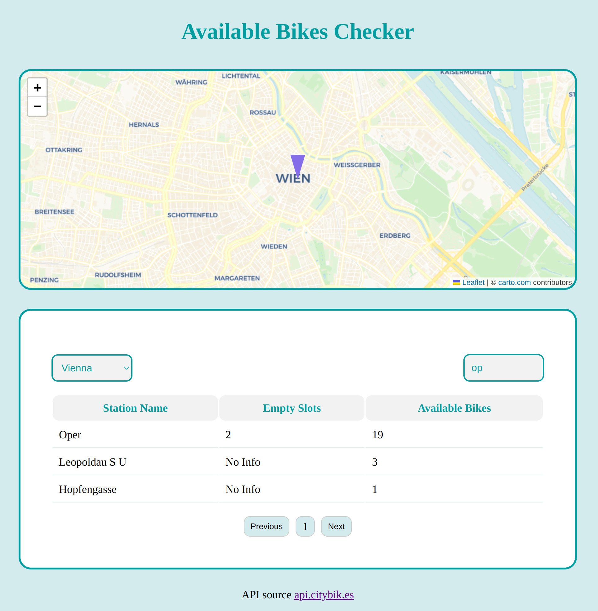

# Available Bikes Checker

## Table of contents

- [Overview](#overview)
  - [The challenge](#the-challenge)
  - [Screenshot](#screenshot)
  - [Links](#links)
- [My process](#my-process)
  - [Built with](#built-with)
- [Author](#author)

## Overview

### The challenge

Users should be able to:

- View the optimal layout on their device's screen size
- See hover states for all interactive elements on the page
- Choose a city from the dropdown menu
- Search station name in the search field
- See bike stations, how many empty slots and available bikes are in each station
- Click on a station name (programmatically scrolls on the map) and see the station on the map

### Screenshot

- Fully Responsive

### Links

- Solution URL: [GitHub](https://github.com/Giorgi-Jalali/available-bikes-checker)

- Live Site URL: [Vercel](https://available-bikes-checker-gjalali.vercel.app/)

## My process

### Built with

- Mobile-first workflow
- [React](https://reactjs.org/) - JS library
- [Styled Components](https://styled-components.com/) - For styles
- [LeafletJS](https://leafletjs.com/) - For Map
- [React Leaflet](https://react-leaflet.js.org/)
- [API from api.citybik.es](https://api.citybik.es/v2/) - For available bikes information
- [Loader Spinner](https://www.npmjs.com/package/react-spinners) - For loader

## Author

- LinkedIn - [Giorgi Jalali](https://www.linkedin.com/in/giorgi-jalali-0336b8225/)
